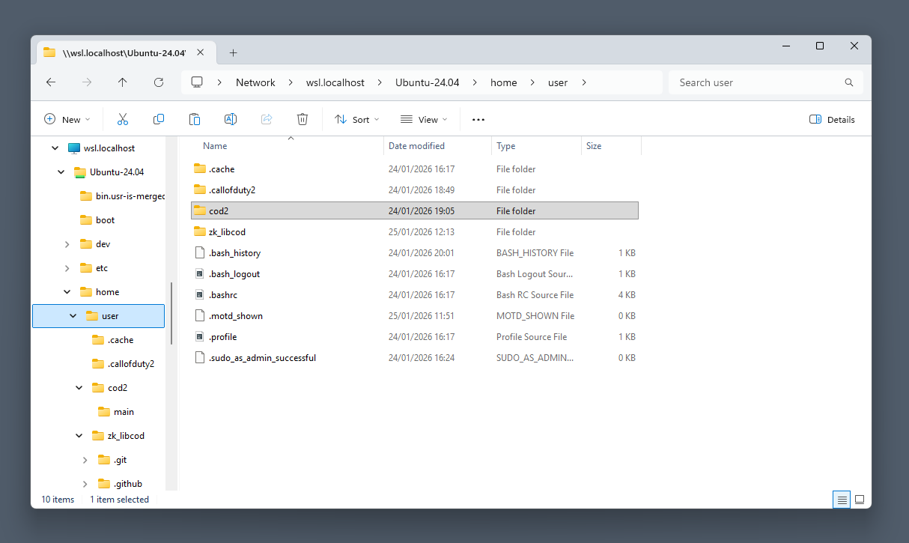
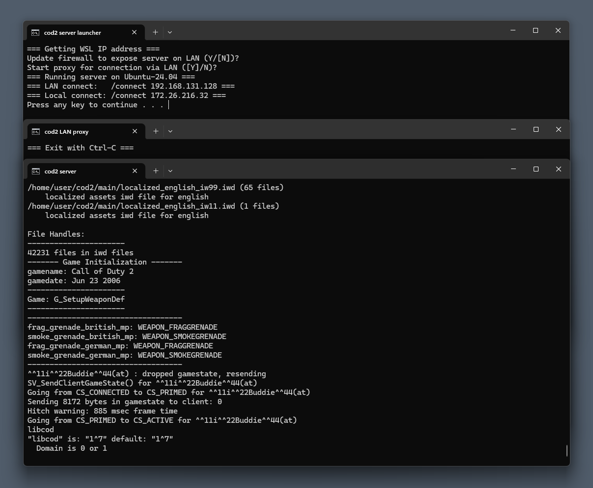

# 🐧 Linux

## Supported platforms
- Ubuntu 24.04
- Debian 13
> [!NOTE]
> This list is not exhaustive and newer versions might work as well.

## 📋 Setup via install script
- Clone the repository or unpack the manually downloaded ZIP
- In a terminal, `cd` into the setup folder
- Run `./install.sh` and follow the instructions
- This builds the project with MySQL and sound streaming (Speex) support

## 🔧 Manual setup

### Requirements / Dependencies
- gcc and g++ (with multilib on 64-bit x86 operating systems)
- libstdc++5
- ffmpeg (optional, see `getSoundDuration` below)
- MySQL client (optional, see `nomysql` below)
- Speex 1.1.9 (optional, see `nospeex` below)

**Requirements installation for 64-bit Ubuntu 24.04 LTS**
```
sudo dpkg --add-architecture i386
sudo apt update
sudo apt install gcc-multilib g++-multilib libstdc++5:i386

# Optional, for MySQL support:
sudo apt install libmysqlclient-dev:i386
```

**Requirements installation for 64-bit Debian 13 ("Trixie")**
```
sudo dpkg --add-architecture i386
sudo apt update
sudo apt install gcc-multilib g++-multilib wget
# Debian 13 and newer no longer provide libstdc++5 via apt
wget http://ftp.debian.org/debian/pool/main/g/gcc-3.3/libstdc++5_3.3.6-32_i386.deb
sudo dpkg -i libstdc++5_3.3.6-32_i386.deb
rm libstdc++5_3.3.6-32_i386.deb

# Optional, for MySQL support:
sudo apt install libmariadb-dev-compat:i386
```

**Sound alias duration support requirements installation**
```
sudo apt install ffmpeg
```
> [!NOTE]
> If not installed, `getSoundDuration(<aliasname>)` always returns undefined.

**Custom sound file docs (for 64-bit Ubuntu 24.04 LTS)**
- [Manual Speex installation](install_speex.md)
- [Audio file conversion](convert_audio_files.md)
> [!IMPORTANT]
> Note: This feature is enabled by default and increases RAM usage by about 500 MB per server. See below for how to disable it (`nospeex`).

### Building the binary
```
# Move into  the code directory
cd code

# Default interactive build
./doit.sh

# Alternative: Without Speex
./doit.sh nospeex

# Alternative: Without MySQL and Speex
./doit.sh nomysql nospeex

# Alternative: Debug build with Speex
./doit.sh debug
```
On success, this creates `libcod2.so` in `./code/bin`.

## ▶️ Running libcod2
- Make sure to have the .iwd files for game version 1.3 in your server's main folder
- Short version, for the command line or scripts:
  - `LD_PRELOAD=./code/bin/libcod2.so ./cod2_lnxded +set fs_game ...` etc.
- Using a simple prepared script:
  - Adapt and use [run.sh](../setup/run.sh) in the setup folder
- Further details are not be documented here, please refer to:
  - [Libcod discussion threads at Killtube~](https://killtube.org/forumdisplay.php?44-libcod)
  - [Call of Duty 2 server meets docker](https://github.com/bgauduch/call-of-duty-2-docker-server)
  - [Running a cod2 server within docker, with libcod](https://github.com/rutkowski-tomasz/cod2-docker)

# 🪟 Windows

## Supported platforms
- Windows 11 via WSL 2, using Ubuntu-24.04 as distribution
> [!NOTE]
> This list is not exhaustive and other versions might work as well. Windows 10 may work, but is not supported here.

## 📋 Setup via WSL install script
> [!NOTE]
> This description and the referenced script were tested on a clean Windows 11 installation only.
- CPU virtualization extensions (Intel VT-x/EPT or AMD-V/RVI) are required
  - If WSL should be installed on the host system, this needs to be enabled in BIOS
  - If WSL should be installed in a virtual machine (VM), this needs to be enabled BIOS and also in the VM's processor configuration
- Download [install.bat](../setup/install.bat) from the setup folder
- Run the script as administrator, it will perform the following steps:
  - It enables the necessary features to run WSL
  - After that, a reboot is usually necessary. The script will indicate this
- After rebooting, run the script again as administrator, it will continue with:
  - It downloads and installs the Ubuntu-24.04 distribution
  - It will ask for a username and password to be set for this distribution
  - It builds the binary from source, this will prompt for the password for sudo elevation
  - It prompts whether sound streaming (Speex) support should be installed too
  - Once completed, it attempts to open [run.sh](../setup/run.sh) from within the WSL directory tree
  - The directory tree could then look as follows, with the game's .iwd files copied into `cod2/main`



## ▶️ Running libcod2
- The run script needs to be adapted, depending on server settings and where the game files are stored
- The following path (e.g., when copied into Explorer) should at this point be accessible, using the username specified during WSL setup:
  - `\\wsl.localhost\Ubuntu-24.04\home\<username>\zk_libcod\setup\`
  - It might take a bit to open this path if WSL first needs to startup in the background
  - Make sure to edit run.sh there and not in other local copies of the repository (if there is)
- To start the server, start [run.bat](../setup/run.bat) from within the setup folder
  - The script will ask if a firewall rule should be added for LAN access to the server (default: false; requires elevation)
  - The script will ask if socat should be started to enable LAN access (more on that below; default: true)
  - The script will show the IP address(es) to connect to from within the game



## 🛜 Notes on LAN access
- By default, the server will only be accessible from the host where WSL runs on
- Windows 11 currently does not support UDP port forwarding via `netsh interface portproxy ...`
- A possibility to enable LAN connectivity could be to use [NAT forwarding](https://gist.github.com/wildlarva/0539212ad6bf0bf1450b38726e1a42de), or a bridged interface mode
- For testing purposes, the tool [socat](http://www.dest-unreach.org/socat) suffices
  - It allows a single player to connect via LAN
  - Socat.exe in the setup folder was built from source version 1.8.1.0, using [Cygwin](https://cygwin.com/) version 3.6.6-1.x86_64
  - If you want to build socat.exe yourself instead, the instructions are as follows:
    - Install Cygwin
    - Install the following packages in Cygwin:
      - gcc-g++
      - gcc-core
      - make
    - Download and unpack the latest socat source bundle ([example link](http://www.dest-unreach.org/socat/download/socat-1.8.1.0.tar.gz))
    - In Cygwin Terminal, navigate into the unpacked folder and run:
      - `./configure`
      - `make`
    - This should create socat.exe successfully within the same directory

